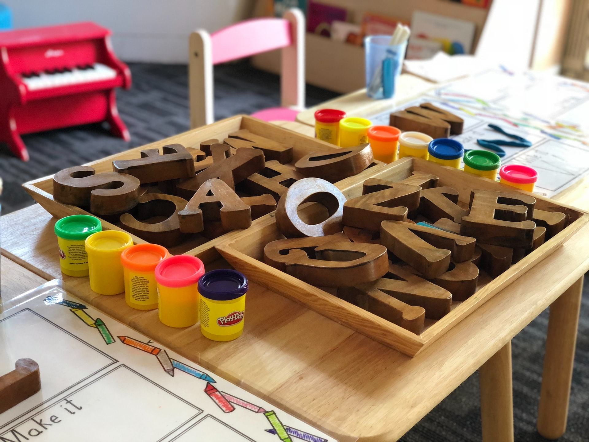

## Daily daycare operations require managing many different tasks simultaneously, plus parents, children, staff, bills, and several other things. However, today, there are various tools on the market that will help you accomplish and organize everything you need for your daycare management.

We are aware that the childcare industry is a very busy one, but having the proper tools available whenever you need them can help you be more efficient and productive. Today, we have decided to gather five essential tools that we know you need that will provide you with the ability to have better daycare management.

1. **Management software**

We know that it sounds like we are tooting our own horn, but the truth is that you do need a daycare management software like KidGenius. Here, you can manage everything from child attendance, staff, billing, communication with parents, educational programs, and every little detail involved in a childcare center’s daily management.

If today you are tracking everything manually on a Word or Excel document, we are sure that you are spending too much time that you could save with management software. Have you considered what would happen if you lost those files or if your computer broke and you had no backup? Disastrous!

A cloud-based childcare management software is the perfect solution for you. It ensures that your data is secured and that everything is always stored in one safe and easy-to-access place.

**2. Accounting software**

We will use the same example we used above. Keeping your businesses’ finances on a sheet of paper or in an Excel document is like referring to methods used in the dinosaur era. There are many great and economic accounting software options available today on the market created to make your life easier. The idea is for you to take advantage of the tools that exist today to save money, time, and offer the best daycare service possible.

**3. Website Design Software**

Does your daycare center have a website? If your answer is no, then the time has come for you to change that. A website will provide an online presence for your business. It will also create a positive first impression on parents that are researching for childcare centers online. It is the perfect opportunity to generate trust and to showcase your services and establishment.

The best way to create an outstanding online presence is with the proper website design software. Yes, you can opt for a professional website designer to make one for you, but the truth is that it can also be costly. Today, there are cheaper options on the market. Content management systems, such as Wix and WordPress, to name two, can help you design a professionally-looking website in very little time.

Here, you have the opportunity to show your future clients, children’s parents, pictures of your daycare center, the programs you offer, who is the staff, and any other information that you may consider relevant.

**4. Email Marketing Software**

KidGenius has an emailing feature that will help you communicate with the parents with only a few clicks. However, if you want to stay connected with them and send them relevant content regularly, or perhaps a newsletter now and then, email marketing software is a great way to do it.

Once again, there are many options in the market you can subscribe to. Still, there is free email marketing software available too. Some of them are Mailchimp, CampaignMonitor, and Benchmark are some of them. You can select predesigned templates, or you can build your own from scratch.

Email marketing is a great way to maintain relationships with parents and stay in touch with them as much as possible.

**5. Social media**

Finally, it is a plus if you engage in social media. It is another excellent way to promote your daycare business and also obtain new clients. There are so many social media platforms today to choose from. Still, the best one for you will be to share useful content for parents regularly, which allows posting images and videos and engaging with your audience, which is the parents, of course.

But you don’t have to spend hours every day on social media figuring out what to post. You can hire a community manager to do it for you. Still, you can program everything yourself every once in a while. That way, you ensure that the social media accounts are active and that relevant content is being posted. Facebook allows programming, but there is also Hootsuite, another great software that will enable you to program Instagram, LinkedIn, Twitter, and more.