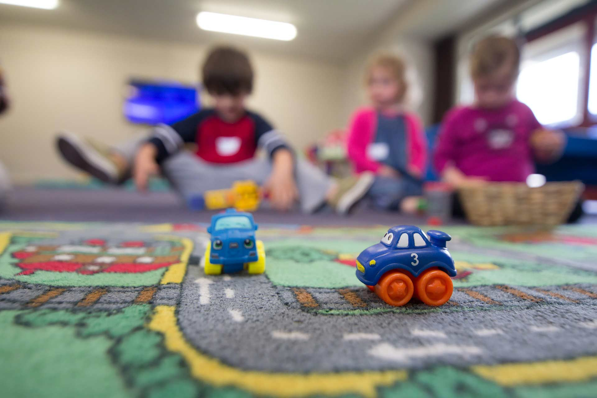

## In today’s world, when it is common to have both parents of a child work full-time to support their family, children will spend a lot of time in a daycare center. For this reason, as well as many others, it is crucial for aspects such as communication, records, and more to be properly registered.

How can you do this without creating dozens of spreadsheets on your computer? Is there a way you can have everything organized in one place? Yes, there is. It is a daycare center app of software, and here are ten reasons you need one for yours.

1. **Improve your workflow**

A daycare management app, such as the one we offer at KidGenius, is designed specially to help you improve your workflow. Since everything is in one place, there is no need to waste time looking for records or data anywhere else but here. The goal of these apps is to make your life easier, and your staff will appreciate it.

**2. More productive staff**

We can assure you that daycare software will allow your staff to be happier and more productive, resulting in less employee turnover. No one likes to work at a place where things are hard to do, where workflows are complicated, and in an environment that refuses to adapt to the new technologies available.

**3. Provide comfort and security**

A day care app will provide parents, staff, and yourself with comfort and security. There is no need to worry about losing records or message a parent quickly in case of an emergency. Everything is easy to find and stored in one place.

**4. Go paperless**

A daycare app will allow you to get rid of all of the tasks you do today on paper. No more having to write down every single time diaper changes, nap time, infant feedings, and running the risk of getting something misplaced. Go completely paperless and keep everything safe on cloud-based software.

**5. Spend more time with the children rather than organizing files**

Organizing takes time, which would be better spent with the children you need to attend at the childcare center. Therefore, a tremendous and valuable benefit you get from childcare management software is the ability to spend less time filing, organizing, and registering data manually and more time with the kids.

**6. Strengthen the relationship with the parents**

A daycare management app will help strengthen the relationship with parents. One of the main focuses of this software is to have better communication. For instance, KidGenius Parents is an app designed specifically for parents to download on their smartphones and monitor how their child’s day has been at the daycare center, as well as communicate easily with the staff members.

**7. Monitor the children’s development**

Childcare management apps are so easy to use that you will be able to record much more information for every child than ever before. Also, parents won’t feel as if they are missing out on something. With KidGenius, it is very easy to upload pictures and register important milestones.

**8. Your overall childcare program will improve**

Thanks to daycare management software, you will be able to offer better services. A more organized business will be a more efficient one, which is why your services will improve, and more customers are likely to arrive.

So, if you have considered implementing childcare management software, we’re happy you agree with us! Check out [KidGenius](https://trykidgenius.com/) daycare management software. Try it free for 30 days or test the demo version online!