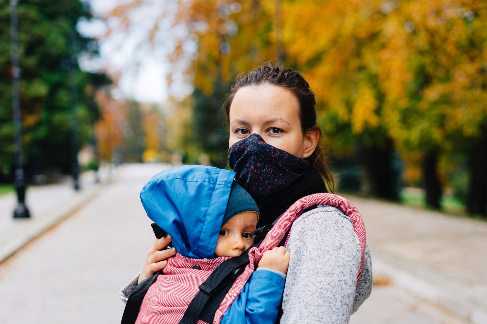
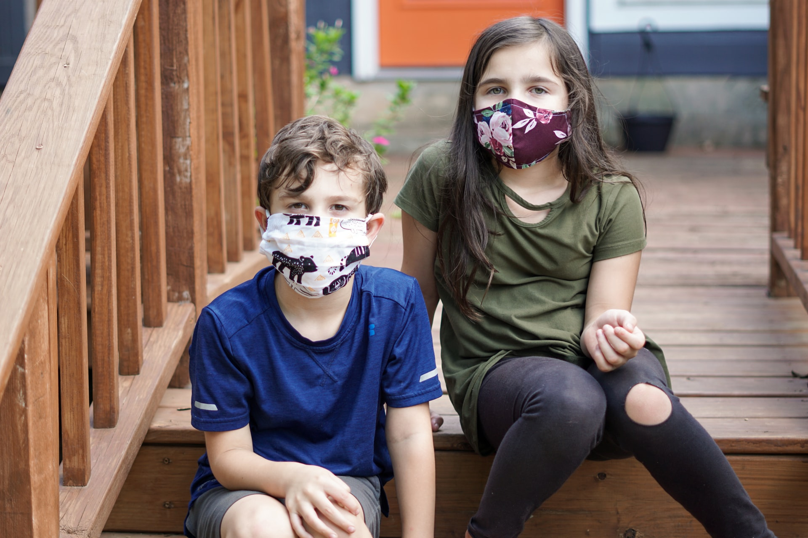

Face masks have become an essential part of our lives. In many places, you need to wear them everywhere you go to prevent infection from Covid-19.

At a daycare center, you need to take [extra precautions](https://trykidgenius.com/blog/guide-for-reopening-your-child-care-center-during-Covid-19-Safety-measures-to-take) to avoid an outbreak. However, can children wear face masks too? Should you require them to wear them while they are at the child care center?

According to information published by [Healthy Children](https://www.healthychildren.org/English/health-issues/conditions/COVID-19/Pages/Cloth-Face-Coverings-for-Children-During-COVID-19.aspx), cloth face coverings can be worn by children 2 years of age and older "including the vast majority of children with special health conditions, with rare exception," they explain.

The reason why children under 2 years old should not wear face coverings is a suffocation risk. People who are unconscious or unable to remove a face covering on their own should also not wear one.

Cloth coverings are important for reducing the spread of SARS-CoV-2, which is the virus that causes Covid-19, to other children and adults.

## When do children need to wear face masks?

If the child is 2 years or older, they should wear face coverings during daycare activities at their childcare center or whenever they are doing group activities.

It is very hard for children to learn the importance of staying six feet away from each other, which is why when wearing cloth masks, infection can be prevented. Outdoors, it is advised to wear them whenever it is not possible to keep a safe distance from each other.

## What happens if my child is scared of wearing a face covering?

Children may be afraid of face coverings at first, but you can implement some of these ideas to help them feel better about them:

* Look in the mirror with the face coverings on and talk about it with the child.
* Put a cloth face covering on a favorite stuffed animal.
* Decorate the face coverings, so they're more personalized and fun.
* Show pictures to the child of other children wearing face coverings.
* Draw a face mask on the child's favorite character or cartoon.
* Practice wearing the face mask at home to help your child get used to it.

## What is the best type of face covering for children?

The face masks that work best for kids are those with elastic. Remember that finding the right fit is important, so finding the correct size is necessary.

You can use cloth face coverings with multiple layers of fabric. Other masks, such as the N95, are not necessary for children.

It is also crucial that children learn not to touch their face covering, so parents can try to model this behavior at home to practice before the child wears his/her own face mask.

For children under 2 years old, social distancing is the best way to prevent infection from viruses. People who are around the infant should wear cloth face coverings too.

## Daycare management software can help you communicate health and safety policies to parents

Daycare management apps are designed to maintain a constant flow of communication between parents and the daycare staff. For instance, **KidGenius** allows you to send messages directly from the daycare app.

Let parents know your [childcare center's policies regarding health and safety](https://trykidgenius.com/blog/Daycare-management-tips-how-to-keep-the-parents-updated-on-the-health-and-safety-policies-of-your-daycare-center). In them, you can explain which children should wear face masks and the benefits of doing so.

Learn more about **KidGeniu**s and how this childcare management software can help your day-to-day tasks and business.