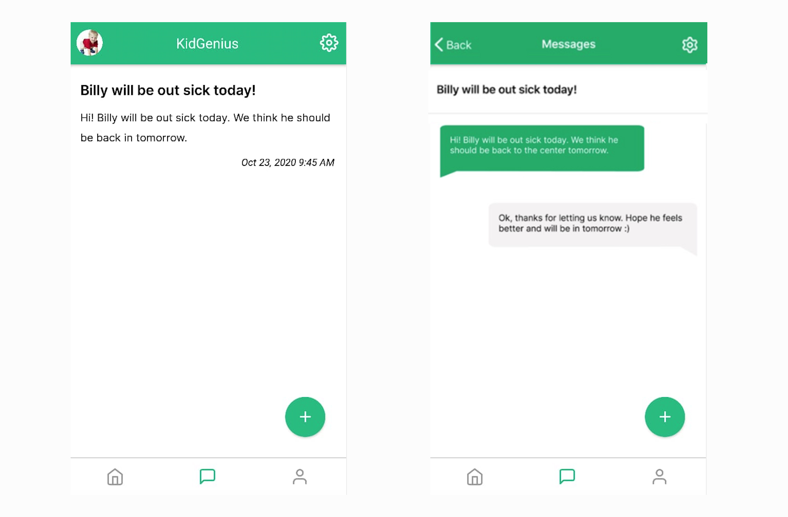

We are excited to present the new KidGenius Parents app that will allow you to keep track of everything your child is doing at his daycare center. You can know in real-time if your child took his nap, had his meal, and had a great time playing during the day!

But, that is not all you can do with the KidGenius Parents daycare app! This app enables parents to:

* View pictures and updates of their child through daily reports
* Communicate with their child’s daycare provider via messaging
* View their child’s information, photos

### Stay updated 24/7

Through KidGenius Parents you can message the daycare center management on the go. Its very easy message center feature works just like a regular chat app where you can exchange information, pictures, and more!

The idea is not only for you to receive messages from the childcare center, but for you to communicate with them to notify if your child’s going to be absent or to ask anything you need.

### Edit your child’s information

Another great feature in KidGenius Parents is that you can easily edit your contact information and your child’s personal information. It is very easy and intuitive.

### A day in a timeline

Knowing exactly what your child’s day has been like has never been easier before. The KidGenius Parents app will allow you to see in a timeline all of the activities that your child has done at his daycare center and when he or she did them.

The Summary option will allow you to see more details about each activity and if the daycare staff has any messages or requests for you.

KidGenius Parents app will only work for parents with providers that use KidGenius Childcare Software. It is available for download for [Android](https://play.google.com/store/apps/details?id=com.kidgenius.parents) and [iOS](https://apps.apple.com/ca/app/kidgenius-parents/id1489814256). Download it on your smartphone today!

