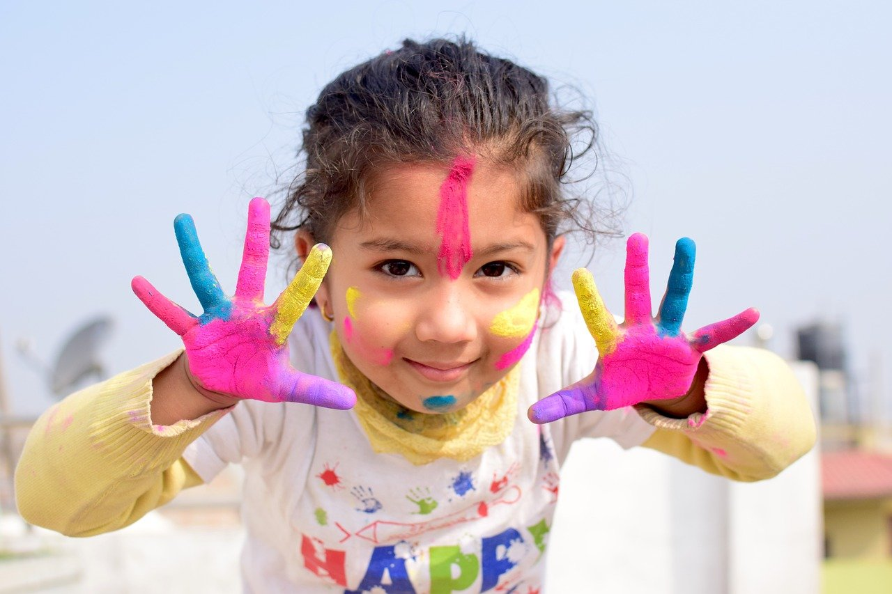
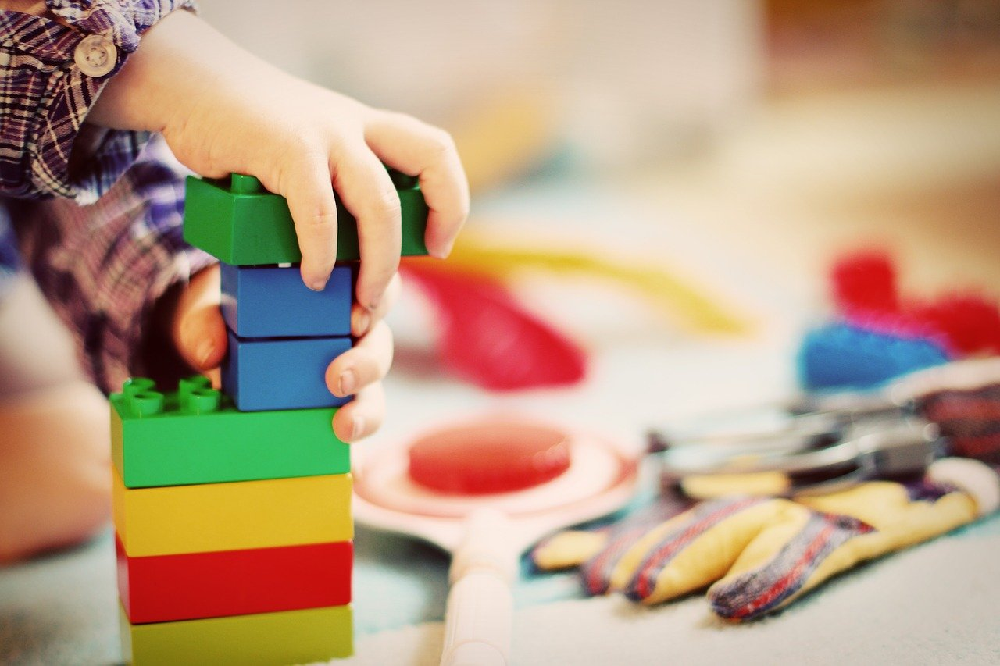

## Today is perhaps more important than ever to keep parents updated on the health and safety policies you implement from the daycare management at your center.

If you have opened your doors again, [there are many things to figure out and plan ahead](https://trykidgenius.com/blog/what-to-do-if-someone-in-your-child-care-center-tests-positive-for-Covid-19), especially in case someone tests positive for Covid-19. Despite this very hard and complicated worldwide situation, health and safety policies are always essential to keep updated at a child care center.

Setting policies for health, security, and safety will protect not only your daycare center but also the children and the parents. They should be provided to everyone that has a relationship with the facility, especially staff and parents.

If you decide to update the policies, it is also important to update everyone by explaining the changes that have been made. Remember that the key to success resides in part in extraordinary communicational abilities.

### What should your policies include?

Some policies that you can include as part of your daycare center management are:

* Child pickup screening
* Sick child procedures
* Disciplinary practices
* Infection control and sanitation processes

Apart from these, you should also add policies related to staffing that include background checking people before hiring them. Your clients rightly demand a safe environment for their children, and the daycare staff is part of it.

[Childproofing your childcare facility](https://www.howtorunahomedaycare.com/articles/setting-up-your-playroomplay-area-safety-first/) is also crucial. Put special attention to these areas:

* Window blind cords
* Cribs should be placed far away from windows
* Cover all unused electrical outlets
* Block stairs and doorways with gates
* Retain straps on changing tables and high chairs
* Secure all medications and cleaning supplies in a locked cabinet out of reach of children

As for the outdoor play area, you can ensure its safety with:

* Appropriate size equipment for each age group
* A soft and resilient surface to cushion falls
* No dirt or grass for surfaces; sand, pea gravel, wood chips, mulch, or a soft playground surface is preferred
* A border area with a fence

Teach the children how to use the toys properly and stay away from moving equipment, such as swings.

Whenever you buy new toys or receive them as a donation, remember to clean them and check if they are in good condition. Do not accept choking hazards or recalls, or anything sharp or breakable.

### How do you sanitize toys?

Before sanitizing toys, they should be cleaned thoroughly—surfaces and potty chairs too. Use soap and water and rinse thoroughly. Then, disinfect with bleach and water solution.

More durable toys can be placed in the dishwater for sanitation. As for cloth toys, linens and clothing, add ½ cup chlorine bleach for colorfast items and non-chlorine bleach for non-colorfast items. Remember to check if the disinfectants are suitable for children.

### Other hygiene practices to consider

Handwashing often will help prevent the spread of illnesses, and it should be something taught to the children. Teach them the importance of washing their hands before eating and after using the toilet.

In the diaper changing areas, be sure to provide disposable latex gloves for the staff and never leave an infant alone.

In Covid-19 times it is also recommended to teach children about social distancing and how important it is to wash their hands and keep them away from the face.

### How to keep everyone updated?

Uploading them somewhere accessible for everyone is a great idea. You can also send a newsletter. However, the easiest way to keep the communication flowing is by using a daycare management app.

KidGenius can help you send messages to everyone you need with just a few clicks. There is no need to type in email addresses, look for the parents’ phone numbers or make calls, one by one.

Learn more about our daycare management software today, and try the demo version for free! [Click here and start now](https://trykidgenius.com/).

Using the In-app messaging feature, you will be able to reach everyone you need to send an update about your safety of health policies (or anything you need) fast and easy.