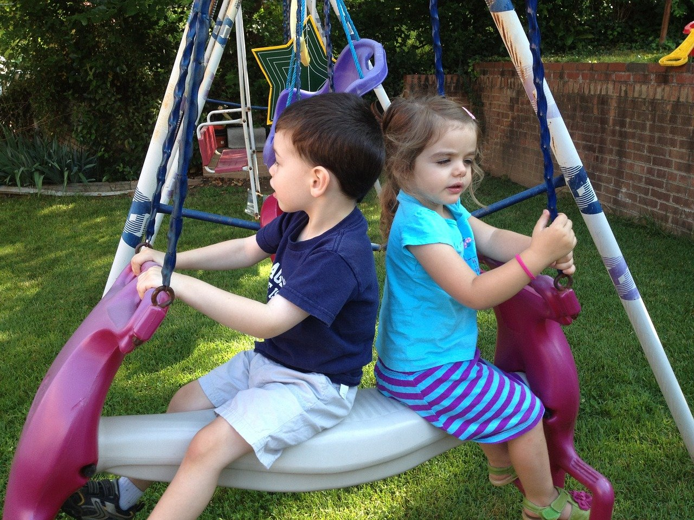
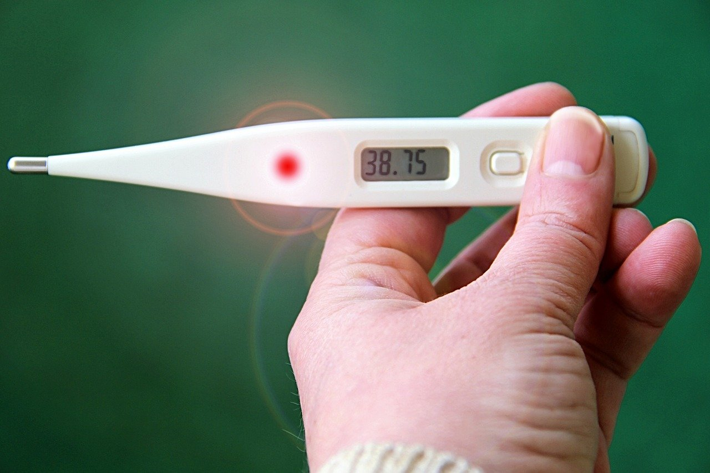

## At the start of 2020, no one thought that we would be dealing with a worldwide pandemic. We have had to learn how to use facemasks, disinfect our hands frequently, and maintain social distancing from one another. Child care centers are no exception to this situation.

However, many daycares have begun to open their doors, not without taking safety measures first, which we want to discuss in this post. If your child care center will be receiving children once again soon, read the following tips.

### Communication is key

There is no such thing as over-communication, especially with the Covid-19 situation. Remember that the coronavirus has created a lot of fear among the population, and many parents are scared that their children could contract the virus at the daycare center.

For this reason, maintaining good communication at all times is key. One way to do it is by using specific daycare management software to easily contact parents, such as KidGenius.

### When will you reopen?

Once you know the date you will reopen the child care center; it is time to do some planning. Familiarize yourself with guidelines the government has set up and ensure that you follow all of the requirements specified.

Next, survey how many children are returning to the daycare center, as well as how many staff will be available. Based on this information, you can begin to look for substitute teachers and check if you have space to take in new children or not.

You also need to be prepared in case of another temporary shutdown if it should occur. Create a plan if this happens so that you can continue the activities online, if possible, and don’t waste any time deciding on what to do. Consider creating a YouTube channel, a newsletter, and changing to online billing.

### Train your staff before reopening the child care center

All of your staff members need to understand new safety protocols and how the daycare will be operating while still dealing with Covid-19.

We recommend you do daily screening procedures for both the children and staff. Monitor everyone’s health so that you can catch a potential outbreak early. Some of the things you can do are check the temperature with a forehead or ear scanner, and where will the screening takes place. We recommend screening the children visually as soon as they come in and looking for any obvious physical symptoms.

You should also decide what type of PPE (Personal Protective Equipment) the staff should wear and what the pickup and drop off procedures will be. A “car drop off” point is a great idea. You will want to limit the number of people that enter the child care center as much as possible.

### What about classroom procedures?

Even with all of the safety precautions, social distancing is necessary. You can use painters tape to create lines and squares to help children remember to stay apart from each other. This is helpful in classrooms, hallways, bathrooms, and other areas.

Keep the same teachers with the same children as much as possible and limit to a maximum of ten children per classroom if you can. If there are siblings, consider keeping them together.

As for mealtime, we recommend disposable tablecloths, plates, plasticware, cups, and have the children eat in small groups. Remember that anything that is not disposable will need to be cleaned several times per day. All of the surfaces will need to be wiped down, as well as the toys.

Of course, many of these activities, such as the disinfecting material, face masks, and more, will add to the operating daycare costs. You will have to budget so that no surprises turn up.

We hope that this is a temporary situation and that sooner rather than later, the entire world can return to normal. In the meantime, you will have to change your daycare business operations and protocols to keep everyone safe.