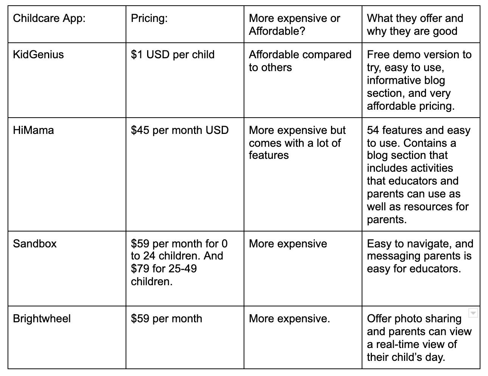

***Photo by Pixaby from [Pexels](https://www.pexels.com/photo/black-calculator-near-ballpoint-pen-on-white-printed-paper-53621/)***

Budgeting is very important when it comes to running a profitable childcare center. If you are considering purchasing software then you need to make sure you can afford to get one. In fact, you might need to budget if getting a childcare software program is high on your list of needs.

But how much does it cost for childcare software? There are many different types of childcare software programs out there on the market. Some are more pricey and some are more affordable.

## Pricing with childcare software management

Most of the childcare management software corporations offer a basic software package containing applications that are popular and desired by childcare centers for a base price. In addition, a good deal of childcare management software provide applications that can be added for an extra cost.

Another factor that affects the price is whether you choose a cloud-based software or a software package that has to be installed on a laptop or computer or server at your centre. As well, many of these softwares come as downloadable apps, so you can use them on your phone or tablet.

These are some of the applications that are included with most softwares:

* Admissions and scheduling
* Billing and payments
* Immunization tracking
* Reporting
* Time and attendance
* Planning Activities
* Communication
* Management with employees
* Managing meals

These are some common add-on applications that softwares include:

* Accounting
* Payment processing
* Payroll
* Additional user licenses
* Premium support plans
* Custom reporting
* Advanced billing options
* Menu creation and billing
* Automated phone messaging
* Parent portal
* Email marketing application

## Comparing pricing and what some of these childcare management softwares offer

***Photo by [Anna Shvets](https://www.pexels.com/@shvetsa?utm_content=attributionCopyText&utm_medium=referral&utm_source=pexels) from [Pexels](https://www.pexels.com/photo/person-holding-bank-card-4482900/?utm_content=attributionCopyText&utm_medium=referral&utm_source=pexels)***

Essentially, you want to choose a software that fits your budget and best meets your needs. There are many more software programs out there but these are a few to name.

## \
Some rules of thumb to follow with budgeting

Evidently, you need more than a software solution to run your daycare center. Some items you will need to budget monthly are suggested by the various applications available in the available software solutions.

Your budget is broken up between income and expenses. You make a profit if your income is higher than your expenses, and unfortunately, you will experience negative profit if your income isn’t higher than your expenses.

Your income consists of tuition paid by parents and fees from subsidized childcare. The expense list is a bit longer, and it includes salaries, bills, taxes, food costs, insurance, supplies, and the mortgage payment or rental for the center. Lastly, another rule of thumb is, “If it isn’t in the budget, then don’t purchase it.”

Learn more about **[KidGenius](http://trykidgenius.com/)** and ask for your 30-day free trial today!