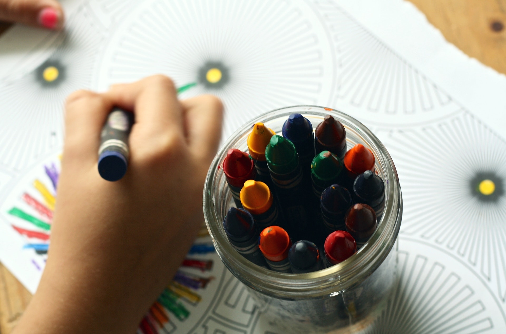
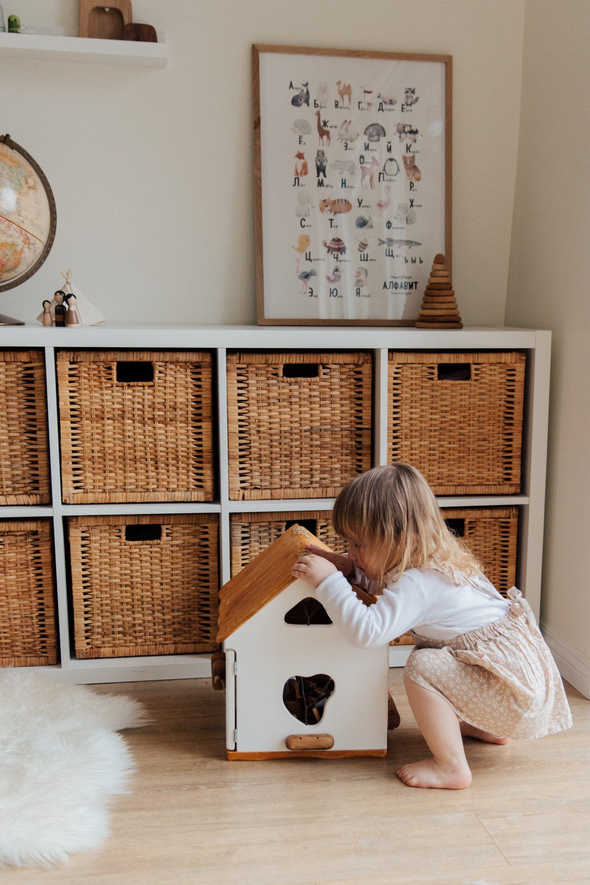
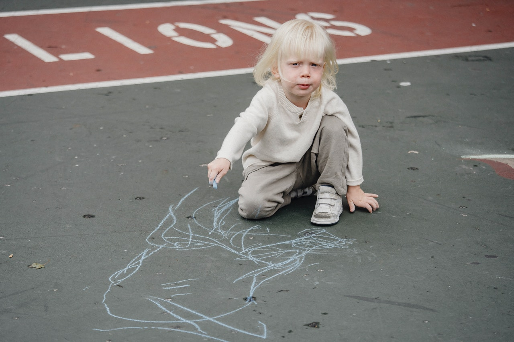

***Photo by Pixaby from [Pexels](https://www.pexels.com/photo/arts-and-crafts-child-close-up-color-159579/)***

Teaching children about COVID-19 and social distancing can be tricky especially when you are dealing with infants and toddlers. They are at a young age where it is hard for them to understand why it is important to social distance compared to kindergarten and school-age children. But there are ways that can you enforce social distancing with infants and toddlers.

## Promote more individual play

*Photo by [Tatiana Syrikova](https://www.pexels.com/@tatianasyrikova?utm_content=attributionCopyText&utm_medium=referral&utm_source=pexels) from [Pexels](https://www.pexels.com/photo/girl-playing-with-a-wooden-toy-house-3933028/?utm_content=attributionCopyText&utm_medium=referral&utm_source=pexels)*

A good way that you can enforce social distancing with infants and toddlers is by having children play individually vs. with other children. Set up individual activities for each child so that they remain distanced apart from other children. Find activities that cater to each child’s specific interests so that it keeps them intrigued, focused, and busy.

This will avoid them from getting up and getting closer to other children. In addition, it is also important to promote individual play because playing alone helps children to develop independence. They don't always have to be around other children. This independence will allow them to feel comfortable in different scenarios. You have to keep in mind that just because a child plays by themselves it doesn’t encourage them to shy away from others.

At the Montessori I work at all the activities are placed in baskets. So, when a child is instructed to choose an activity they can pick whatever basket they like and this promotes individual play.

## Incorporate activities that will keep children socially distanced

*Photo by [Allan Mas](https://www.pexels.com/@allan-mas?utm_content=attributionCopyText&utm_medium=referral&utm_source=pexels) from [Pexels](https://www.pexels.com/photo/adorable-kid-drawing-on-asphalt-5622405/?utm_content=attributionCopyText&utm_medium=referral&utm_source=pexels)*

Now if you don’t want to always incorporate individual play you can still do group activities that will encourage social distancing. Outdoor play is an ideal time when you can do group activities that will promote social distancing. Outdoor play alone is great as there is more space for children to run around and be more distanced from other children.

Some activities that you can do are drawing chalk circles or outlining circles with tape and having the children jump on and in the circles. This way the children will be six-feet apart when they are doing it. Hopscotch is also good since it would be one child at a time. You can also draw animals on the ground.

Also getting children to sit distanced apart and having them draw with chalk is a good way to promote social distancing. Keeping in mind whenever you are setting up an activity have the children positioned so that they are distanced apart and reminding them to remain in their spots. This should be done during a meal, or circle time as well.

Learn more about KidGenius childcare management software today and request your [30-day free trial](https://trykidgenius.com/)!