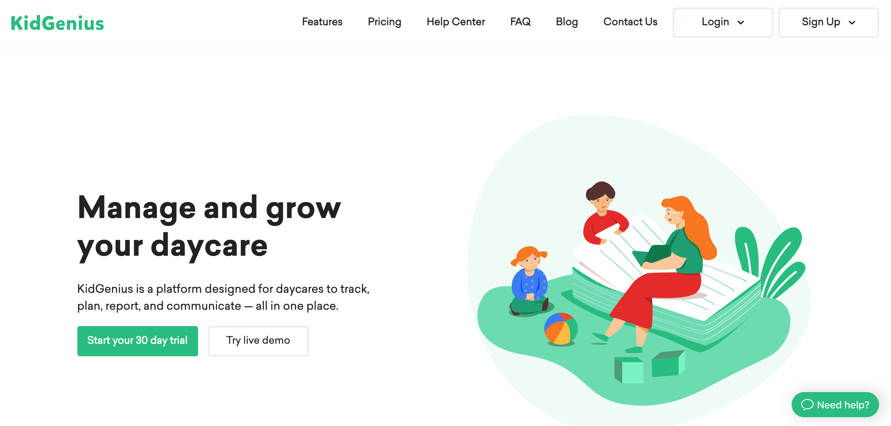
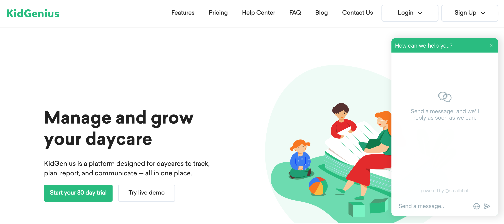

*Photo by [Karolina Grabowska](https://www.pexels.com/@karolina-grabowska?utm_content=attributionCopyText&utm_medium=referral&utm_source=pexels) from [Pexels](https://www.pexels.com/photo/person-using-a-macbook-and-holding-a-credit-card-4968391/?utm_content=attributionCopyText&utm_medium=referral&utm_source=pexels)*

So, you are the business owner of a childcare center, and you are thinking about purchasing a childcare software. There are many benefits to purchasing a childcare software as having one can help to manage your childcare better and provide more organization, better productivity for workers, and save workers time, so they can focus on other things such as focusing more on children and their needs.

But it is important that you do your research and ask the right questions when you are shopping for a childcare software. You want to make sure the software you purchased has everything you need. Here are some important questions to ask you’re shopping for a childcare software:

## Will purchasing this daycare app help with the issues I am experiencing?

*Photo by [Startup Stock Photos](https://www.pexels.com/@startup-stock-photos?utm_content=attributionCopyText&utm_medium=referral&utm_source=pexels) from [Pexels](https://www.pexels.com/photo/smiling-man-and-woman-both-sitting-on-sofa-both-looking-at-silver-macbook-7075/?utm_content=attributionCopyText&utm_medium=referral&utm_source=pexels)*

The first question you need to answer when considering purchasing a software for your daycare is...“What issue am I trying to solve?” Keep in mind, you run the risk of buying a software that lacks the features you need for your daily operations if you have not clearly identified the issue(s) you are trying to solve.

To make your childcare facility run smoothly, make a list of all the daily, weekly, and monthly operations you and your employees do. Then, look at fields that routinely cause red flags or that slows down operations.

Common operations to automate consist of:

* [Billing and finances](https://www.ezchildtrack.com/billing-and-statements.html)
* Scheduling
* Staff management
* Data storage

## Am I able to get a free trial or demo?

It is important that whatever software you choose to purchase that you ask if it comes with a free trial or live demo. Many daycares need to budget in order to purchase a software so having the luxury of getting a 30-day free trial will definitely help.

In addition, being able to view a live demo of how the software works for free is very helpful. You will be able to see how to navigate the software before using it. As well, once you see that it is easy to navigate you will feel more confident in using the software and then showing your employees how to use it.

## Will I be able to get any support or training if I have any questions about how to use the software?

Although most softwares are easy to navigate not everyone is tech-savvy, so it is helpful to have tech support if you have any questions or concerns. Having a live chat option is great as you can ask any questions and get an immediate response.

Getting support is always appreciated and relieves any stress or tension if you are having any issues with navigating the software. Or if you want to add any extra features it is helpful to have that instant messaging option.

## Is the software I am considering designed for childcare management?

*Photo by [Lina Kivaka](https://www.pexels.com/@lina?utm_content=attributionCopyText&utm_medium=referral&utm_source=pexels) from [Pexels](https://www.pexels.com/photo/person-reading-a-book-1741230/?utm_content=attributionCopyText&utm_medium=referral&utm_source=pexels)*

If a software vendor tells you that a software package can easily be adapted to childcare management, keep in mind this isn’t always the case. This might be an indicator that the software corporation doesn’t have expertise in the childcare industry.

So what does this mean? Well, for their standardized business applications to be personalized to suit your needs, it would take more time and resources. There are several options available that already appeal to the demand for childcare. At the end of the day, you don't want to be stuck with a bundle of apps that won't meet your needs and requirements. The last thing you want is to spend money on a software, and it doesn’t work right for your childcare center.