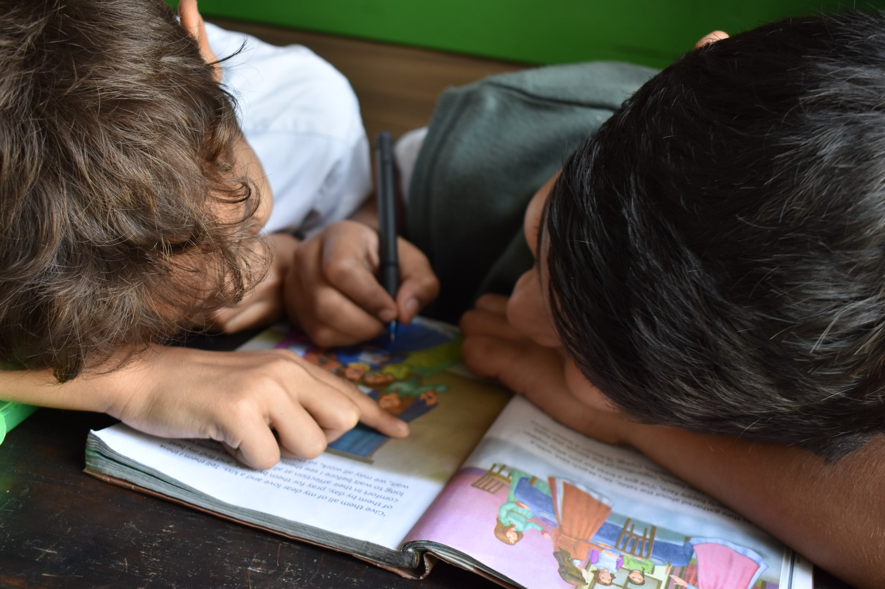

## As we have addressed before on this blog, Covid-19 has caused everyone’s reality to change in many ways. A child care center is no exception.

We have given you [tips for homeschooling your children](https://trykidgenius.com/blog/Parents-guide-for-homeschooling-their-children-while-daycares-are-closed-during-Covid-19), and we have also given you some ideas on how to [make your child care center safe if you have decided to reopen](https://trykidgenius.com/blog/guide-for-reopening-your-child-care-center-during-Covid-19-Safety-measures-to-take). In this blog post, we want to talk about how to communicate with parents if you are still closed or need to close again.

Communicating with the parents properly will be critical in the success you have as a child care center. When you receive a child at the daycare, they also come with the parent. It is two for one.

They are the ones you will be communicating with and talking about essential things regarding the child’s education, behavior, and other important issues. They are also the ones who will pay for the service.

For these and many other reasons, and especially in Covid-19 times, communication has to be on the spot.

### Three steps for communicating with parents

Whether your daycare center is closed because of the pandemic or whether the world has already returned to normal, communication is always important. On this occasion, we want to give you some tips on how to stay in contact with the parents if you have had to close down for a while.

Remember that the main objective is to provide the best child care for the children you care deeply about as a daycare manager or teacher.

1. **Notice how you are feeling**

When you are not aware of your feelings, they can interfere in communication and in building strong relationships with the parents. Don’t let emotions get in the way and interfere with achieving the end goal, which is to provide the best possible care for the children enrolled in the daycare center.

**2. Look at the situation from the child’s point of view**

Whenever something is taking place regarding the child, turn to his/her point of view. You will see how this leads to problem-solving ideas.

For instance, if the child throws a tantrum when the parent comes to pick them up, they may feel embarrassed or incompetent. However, what the child is probably trying to say is that they are having a lot of fun and are not ready to leave yet.

Observing what the child’s behavior means and explaining it to the parent will create a better bond between you too. It will also create a more communicative environment.

**3. Become partners with the parents**

Develop plans together with the parents on how to handle the child’s issues. The parents are not your competitors; they are your partners.

Ask for the parent’s perspective as much as possible, and give your own opinion based on facts. Also, look for a place to compromise. You can ask the parents to provide you with ideas for what the next steps should be.

Finally, don’t forget to check in with the parents to see how things are going at home. They will appreciate the attention and the interest you are showing in the child’s well-being.

### How to stay in contact with parents if the daycare center is closed

You can put several things into practice to stay in contact with parents if the daycare is closed, for Covid-19, or whatever reason.

First of all, if you have closed the daycare but are still active sending homework for the children or connecting via Zoom or other software to provide online classes, you need to stay in touch with parents to:

* See how they are handling teaching the child at home;
* Check if they have any questions about the activities;
* Ask if they have any questions or concerns about the child’s behavior and/or learning.

Communicating often also allows the parents to stay in contact with you. They will even know that they are not alone in the process and that you have their child’s best interests at hand.

A great way to stay in contact is, of course, making phone calls, texting, or emailing the parents. However, there are better and more efficient ways of communicating nowadays: smartphone apps.

For instance, the KidGenius Parents app was created specifically to communicate with parents. With it, the parents will also have the ability to view all the historical activities their child has done at the child care center and send messages to the management team without having to give out their personal phone number and in a very easy manner.

This app works exclusively with the KigGenius daycare management software. On the other end, the daycare staff will be able to keep track of activities, meals, milestones, absences, and much more.

The app is also handy when the daycare center is physically closed because the records are still all there, and you can communicate very easily with the parents whenever you need to. When you reopen, it will be as if you never closed in the first place.

As a child care provider, keep in mind that developing positive relationships with parents is essential to providing the best care possible to their children. Let KidGenius help you achieve that.