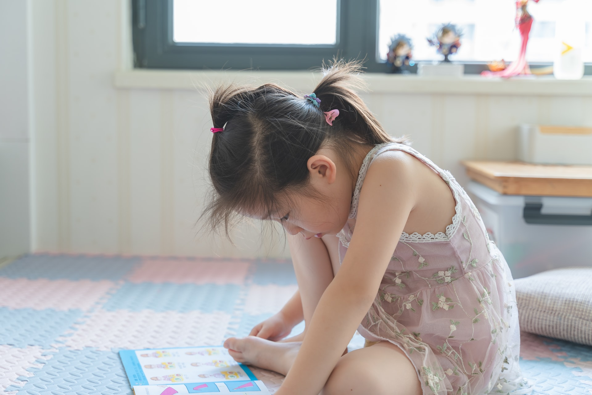

## Today’s reality has changed a lot, and no one knows when things will get back to normal. It is possible that your daycare is still closed, or you do not want to risk taking him/her while new cases of Covid-19 are still emerging in your area.

For this reason, you may be considering homeschooling your children until you feel it is safe to take them to the childcare center or until they open their doors once again to the public. If you decide to try homeschooling for now, here are some actions you need to take into consideration.

### Attend activities and meetings virtually

Many daycares are offering virtual activities for the children who are at home and meetings for the parents. Try to attend these events as much as possible since it will help your child socialize. On the other hand, you will be able to express concerns about the day care’s plans and speak with the teachers and other parents.

### Create a schedule

Creating a schedule with your child is very positive since it helps you commit to the daily activities and stick with them. For children, structure and routine can help them stay on schedule with assignments and balance playtime and study time.Discuss the family’s schedule to identify the best times for learning and relaxing throughout the day. It helps to create a family calendar to help keep track of deadlines, assignments, and other important appointments for some people.

### Make a distraction-free space at home

Try to find a space at home where your child will be free of distractions, noise, and clutter to learn and do homeschool tasks. It could be in the dining room or living room, wherever it is well-lit, or perhaps on a quiet corner at home where you can fit a small table.

### Socialization is important

If your child is being homeschooled, it is also essential to create opportunities to connect with peers, even if it is virtual.

### What should you ask your daycare center?

In the case that you are going to homeschool your child, but still will be working with the daycare’s program, there are a few things you should ask the childcare center:

* Ask if there will be regular and consistent opportunities every day for peer-to-peer learning;
* Find out if there will be live video learning classes or pre-recorded videos;
* Will there be any assignments?;
* Are there going to be physical activities with social distancing?;
* Is there school counseling available for emotional and social support?;
* If your child receives occupational, speech, or physical therapy at the daycare center, ask how will these services continue if he or she is now homeschooled;
* In the case that you anticipate technological barriers at home for homeschooling, ask the daycare center if they will provide electronic devices for schoolwork.

### Additional things to consider if homeschooling your child during Covid-19

Your child may experience behavior changes, such as excessive crying, irritation, sadness, excessive worry, unhealthy eating, changes in sleeping habits, and difficulty concentrating. This could indicate that your child is struggling with stress and anxiety. If this occurs, talk to your daycare center to help with managing the situation at home.

Breaks are also necessary throughout the day. It is also a way to teach your child about self-care. Getting plenty of sleep, exercising, eating well, and staying socially connected are great ways to practice it.

### Tips for succeeding with homeschooling

1. **Be flexible**

Even if you have set up a schedule, be flexible with your children, activities, and expectations. People who are rigid when homeschooling are rarely willing to make adjustments along the way, ending up in frustrations.

**2. Have fun**

Part of being schooled at home is taking advantage of the situation. This means playing games, watching movies, going on field trips while maintaining social distancing. Learning can occur anywhere you go!

**3. Don’t make comparisons**

Everyone’s journey and situation are unique, so comparing yourself to other homeschool parents or children makes no sense at all.

**4. Take breaks, don’t burnout!**

It can get overwhelming when having to not only deal with the Covid-19 situation, but home chores, your own job, and on top of everything, homeschooling your children. Therefore, take breaks. Not everything is studying and working. You will need these breaks to avoid burning out.