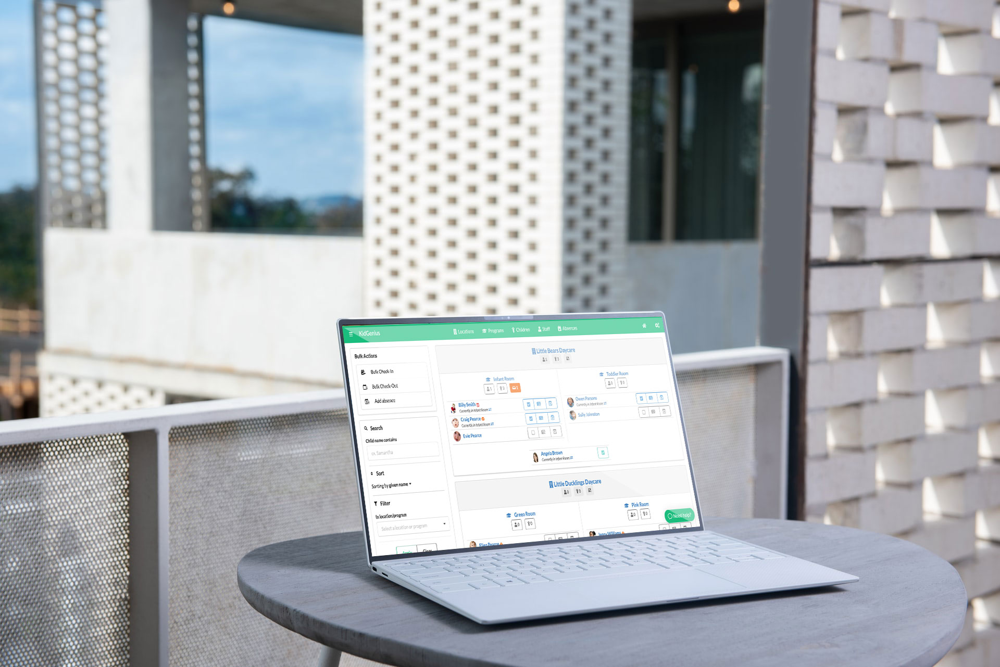

## When your daycare center is small, and you are just starting out, pretty much everything you need to keep track of billing, children's attendance, and staff are only a few color-coded folders. However, as your childcare business starts to grow, we know that you will benefit significantly from a childcare management software.

The main reason is that a childcare management software is a system created to help you keep everything in one place, organized, easy-to-find, and error-free. You will have automated and streamlined software with many functionalities. Plus, if it is cloud-based, you can access your information from anywhere you are located by using your smartphone.

For this reason, if you are about to inaugurate a new daycare center or reopen after Covid-19, a childcare management software will be of great help.

By using this software, there is no need to enter data repetitively. You'll be able to manage invoicing, messaging, absences, programs, daily activities, and more, depending on the software you're using.

### Take a look at some areas where a childcare management software can help you with

#### Attendance

Keep track of both your [staff](https://trykidgenius.com/blog/tips-for-building-a-successful-daycare-staff-team) and children's attendance. Who is present and who is absent with just a few clicks. Also, you can register when a child will be absent for vacation or other reasons.

#### Report generation

If you need reports from your data in the childcare management software, you can generate them easily. Generate custom reports based on attendance hours, age, subsidy status, and more options. You can also choose to export to Excel, where you will be able to do further editing.

#### Bulletin board

Keep track of everyone's meals, activities, and forms for parents to read using bulletin board features. It is an excellent way to better the communication and to keep everyone informed opportunely.

#### Daily report cards

Childcare management software allows you to keep track of activities that occur on a daily basis at the daycare center. Meals, naps, activities, and milestones are some of the things that you can register with a daycare app. Plus, everything will be emailed to the parents every day to keep them in the loop.

#### In-app messaging

As we mentioned above, communication should always be one of the most important things to work on with any business, including a childcare center. Parents have trusted you with their children, and they will be pleased to learn that you keep them updated continuously about anything related to their child.

Daycare management software allows you to use features such as in-app messaging, which are very quick and easy to use. By using them, you eliminate the need to use your personal phone to message parents, and you also keep a detailed control of every message that has been exchanged.

#### Billing and invoicing

Many software apps created for daycare management purposes have the option to generate and send invoices. You can even schedule this task in advance, so you don't forget to do it every month or whenever you invoice parents.

Some also include accounting software that helps cut down the manual work involved in the invoice process, as well as online payment options.

#### Secured data

Also, high-quality childcare management software will offer you security for your data. Every piece of information you submit into the app will be private and secured.

Learn more today about KidGenius childcare management software. You can [test the demo version](https://trykidgenius.com/) or request your 30-day free trial!