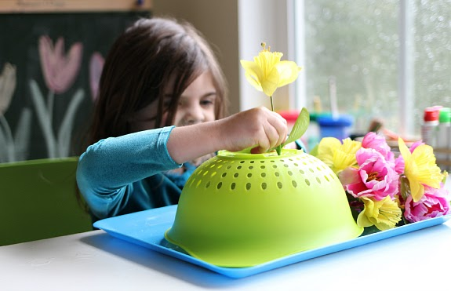

***Photo by [Victoria Borodinova](https://www.pexels.com/@victoria-borodinova-392079?utm_content=attributionCopyText&utm_medium=referral&utm_source=pexels) from [Pexels](https://www.pexels.com/photo/woman-and-child-playing-in-snow-1620651/?utm_content=attributionCopyText&utm_medium=referral&utm_source=pexels)***

As an early childhood educator, you want to do creative activities with your children. Here are some great ideas for you to do!

## **Snow paint**

Photo by [Vanessa Serrao](http://vanessa-serrao.com/)

Snow paint for the outdoors is a creative and fun activity you can do with infants and toddlers. All you need is a spray bottle, water, and paint. You mix a spray bottle with some paint and water and voilà you have a fun and simple activity you can do outside.

It is a good idea to have a few bottles of spray so that you can spray different colors in the snow. I like to use vibrant colors like green, red, purple, or blue. This activity is also beneficial as you can teach toddlers about colors. You can also spell out words with the spray and create things in the snow that will be visual for the children to see.

For example, you can draw animals you know they know and ask them what animal it is and what sound that animal makes. They can guess and identify what you are drawing and teach them numbers by drawing out numbers such as 1, 2, and 3. If you have children that are a bit older you can do sight world recognition with preschoolers, kindergarten age, and even school-age children.

Depending on their age and development you can make certain activities more challenging. All children develop differently and excel at different developmental milestones. Some children may have very strong fine motor skills while another child may have very strong communication and vocabulary skills.

## Bubbles

***Photo by [Hiếu Hoàng](https://www.pexels.com/@hieu?utm_content=attributionCopyText&utm_medium=referral&utm_source=pexels) from [Pexels](https://www.pexels.com/photo/toddler-girl-wearing-white-and-black-sweater-holding-plastic-bottle-of-bubbles-at-daytime-712141/?utm_content=attributionCopyText&utm_medium=referral&utm_source=pexels)***

Who says you can’t blow bubbles in the wintertime as well? Bubbles are a great activity for children as it intrigues their senses. They can touch or pop the bubbles and also observe the bubbles in the air. Blowing bubbles will naturally promote toddlers to explore and to play with purpose.

It permits fun, enjoyment, and excitement that will guide their curious minds and learning. You can also teach children how to blow bubbles. In addition, an extension you can do with this activity is making your own blowing bubble stick. It can be a craft that you do with them, and you can get them to paint and decorate them, and then each child can have their own.

## Fine Motor Tray with Flowers

Photo from [No Time For Flash Cards](https://www.notimeforflashcards.com/2015/03/spring-fine-motor-tray-activity.html)

\
This is an activity you can do both indoors and outdoors. I believe it to be a good outdoor activity you can incorporate if you aren’t sure what you can do with toddlers as an activity outside. As well, you should always be promoting activities that help develop young children’s fine motor skills.

You can purchase all the items for this activity that you will need from the dollar store. All you need is a pot strainer or something with holes in it, and pretend flowers. The goal is for the children to place the flowers in the holes. And again this promotes their fine motor skills and helps develop them.

Have you checked out **[KidGenius](https://trykidgenius.com/)** daycare management software? Use our 30-day free trial and see everything we can do for you and your business!