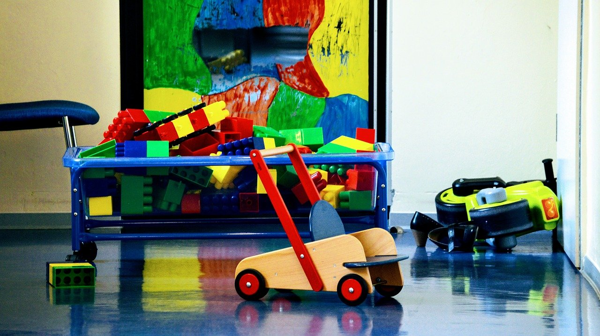

## It seems as if Covid-19 will still be part of our lives in the upcoming future. As the end of 2020 approaches and even though the arrival of a vaccine has made its way into several countries already, the end of this pandemic is still not clear. Therefore, any day care center that is still operating has had to find a “new normality” to survive as a business and offer its services.

[Blackstone.edu](https://blackstone.edu/covid-19-in-child-care-centers/) wrote an article about how this situation has impacted children. Some of them have suffered (and are suffering) from anxiety and stress. Since young children are very receptive to the adults’ emotional reactions, depending on how the situation is handled at home, they will respond one way or another.

“It is important for us to remain calm as we teach a new set of clear expectations and routines. This is vital to a smooth transition back to daycare”, they suggest.

### What should a day care center consider in this situation?

One aspect that daycare management should consider is that some children may regress in their education. This is common after extended breaks, routine changes, and high levels of stress.

Blackstone explains that regression regularly occurs more in toileting, eating, and sleeping. They can also present separation anxiety and elevated frustration levels. Try to be understanding of their feelings during these difficult times. If adults are struggling, you could imagine that children could also be having a hard time.

*[Here are some tips for reopening your day care center during Covid-19.](https://trykidgenius.com/blog/guide-for-reopening-your-child-care-center-during-Covid-19-Safety-measures-to-take)*

### Are daycares safe?

An article by [USA Today](https://www.usatoday.com/story/news/education/2020/05/18/coronavirus-daycare-safe-childcare-reopening-guidelines-cdc/5205192002/) published in May explored the question “are daycares safe”? In it, they discuss the different measures child care center have had to take to avoid contagion. Still, they also agree that for the parents to work properly, whether they are at home or their job posts, they need to take their children somewhere during the day.

“Temperature checks, hand-washing, and face masks are constants at preschools and child care centers around the country. Class sizes have limits, and some lunchrooms and common areas are off-limits. The safety measures pose a constant reminder to families: These are not normal times”, they wrote.

However, the risk of sending their children to a daycare center is always there. Nonetheless, it will depend on the city or town, if there is an outbreak, and how strict the health measures are at the childcare center.

“For many parents, it’s more than a safety decision. It’s an economic one. They cannot work if they cannot send their children somewhere during the day,” they said.

For this to work in the best possible way, parents and daycare management need to work as a team with proper communication, trust, and with the same goal in mind: stop the spread of the virus.

### Tools that will help with daycare management

A tool we suggest you try for your daycare center is specialized software that will help you manage your everyday activities. In these complicated times, you need to have tools available to keep everything organized, make communication with staff and parents easier, and have the children’s data in one place.

Some of the features software like this has that you can use to your advantage are:

* **Attendance tracker**: Keep track of the children’s and staff attendance and absences and generate monthly reports.
* **Report generation**: Generate custom reports based on age, attendance hours, or subsidy status.
* **Bulletin board**: Here, you can know about every activity that has taken place in the day care center, such as meals, activities, announcements, and forms for the parents.
* **Daily reports**: This feature helps you keep track of meals, naps, activities, and more, and sent to the parents every day.
* **In-App messaging**: This is a built-in messaging system that allows communication with the parents directly. Therefore, it is very quick and easy-to-use.
* **Secured data**: Daycare management software allows you to have all your data secured in a cloud-based platform where you can access it wherever you are with an internet connection.

Learn more about how KidGenius daycare management software can help you right now during these difficult times. Contact us, try our live demo version or start a 30-day free trial at [www.trykidgenius.com](http://www.trykidgenius.com).