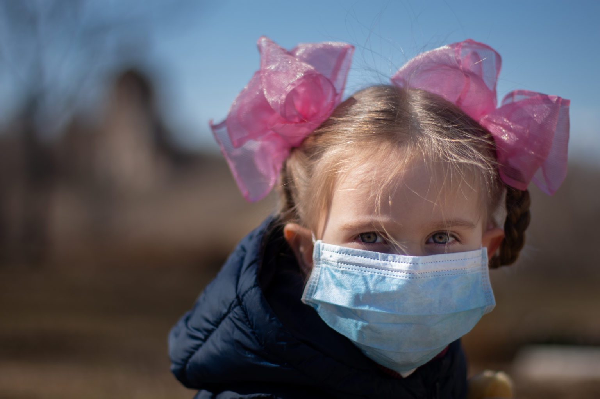

## A little while ago, we gave you some [tips for reopening your child care center](https://trykidgenius.com/blog/guide-for-reopening-your-child-care-center-during-Covid-19-Safety-measures-to-take) during the pandemic we are still living in the entire world. However, even though we are sure you have been incredibly careful, it is possible that someone in your daycare tests positive or is exposed to COVID-19.

What to do if this occurs? It is easy to feel scared since the fear of getting infected is very common. Still, the most important thing is to stay calm and establish a protocol if this were to happen in your child care center.

As long as you act swiftly and transparently, your center will be okay. However, you need to learn the protocols your country or state requires you to take if someone tests positive at your child care center.

Nonetheless, here are some tips you can follow:

1. Whether it is a staff member or a child who tested positive for Covid-19, find out the timeline when the exposure might have occurred. 

   Exposure means that within 48 hours of onset symptoms, you had at least 15 minutes of contact within six feet of the person's distance who tested positive.
2. Then, you need to vacate the room entirely and set it off-limits for at least 24 hours before disinfecting and sanitizing it. You should have another room available for children to go to while the other classroom is being cleaned.
3. Get in touch with the families of those in contact with the person who tested positive and let them know of the situation and how you deal with it at the child care center.
4. If someone from your child care center begins to have symptoms or test positive for Covid-19, you must contact health authorities and close the center for at least 48 hours to do a deep clean. 

   If you have to switch to online classes for a while, here is a [parent's guide](https://trykidgenius.com/blog/Parents-guide-for-homeschooling-their-children-while-daycares-are-closed-during-Covid-19) we shared on our blog a little bit ago that could help you and the parents. Also, have a list of substitute teachers if you need to replace one of yours for a while.
5. If someone starts to show symptoms at the daycare center, place them in a room with minimal toys or furniture, and make sure that the staff members are wearing proper [PPE](https://www.health.com/condition/infectious-diseases/coronavirus/what-is-ppe). If it is a staff member, send them home immediately.
6. If one of your staff members begins to show symptoms at home, have them get tested and ask them to quarantine for 14 days since the day symptoms began. If they test negative, wait at least 24 hours and have them get tested again. If it is negative once again, you can allow them back at work.

### Remember to contact parents and guardians as soon as possible

We understand that you might fear stigma regarding someone testing positive for Covid-19 at your childcare center. Still, the best thing you can do is keep the information as transparent as possible. People will appreciate it.

You should notify all of the parents and guardians of the children enrolled at your daycare center of the outbreak, which is considered if someone was confirmed positive. Explain to everyone that you will be closed for a few days to disinfect the premises, and anyone who was in contact with the confirmed cases should self-quarantine for at least 14 days.

Remember that it is also important to report all the positive cases to the relevant authorities and your local health department.h In some countries, failure to report can result in penalties, such as the removal of your operating license.

Remember that we are all learning on the go about how to deal with this delicate situation. Still, communication will be key for your daycare to continue to operate safely despite the circumstances.

You can maintain a good communication flow with the parents and staff by using daycare management software, such as **KidGenius**. This software offers features such as in-app messaging for fast and easy communication. You don't need to go to your phone and text everyone individually to send out a notification; you can do it efficiently within **KidGenius**.

Learn more about us [here](https://trykidgenius.com/) and try out the live demo version!